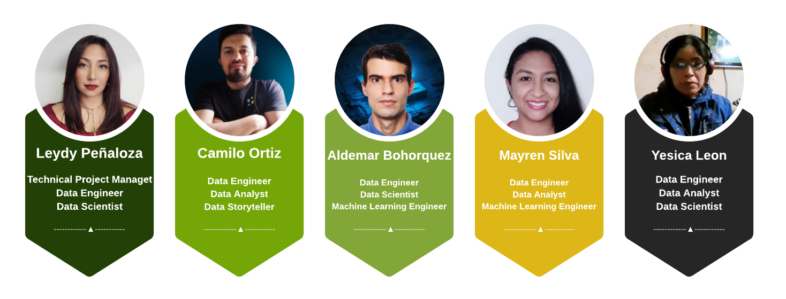
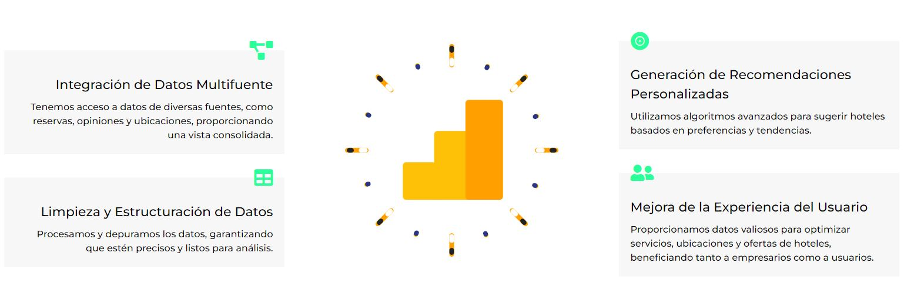
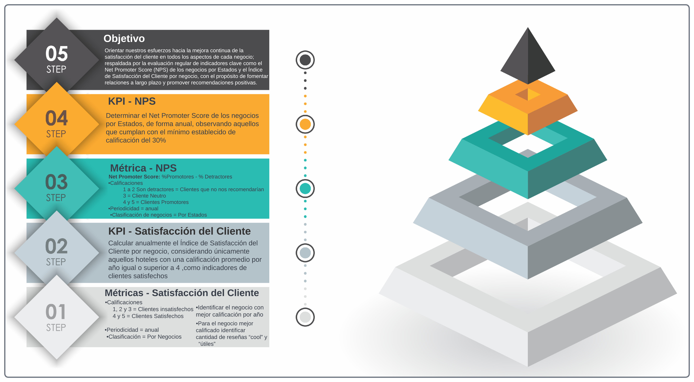
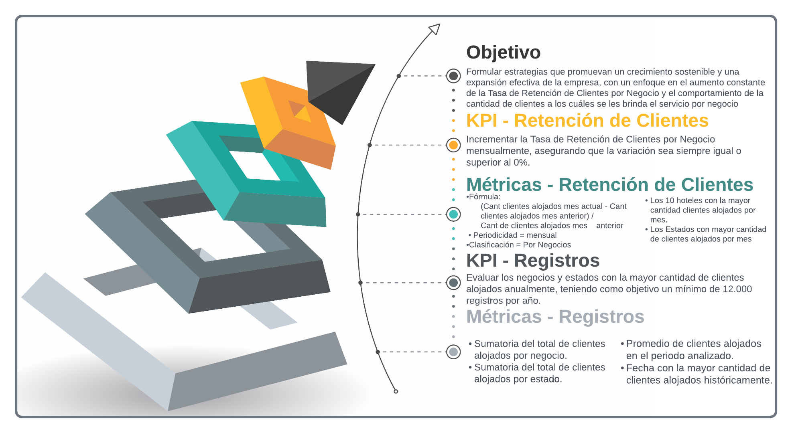
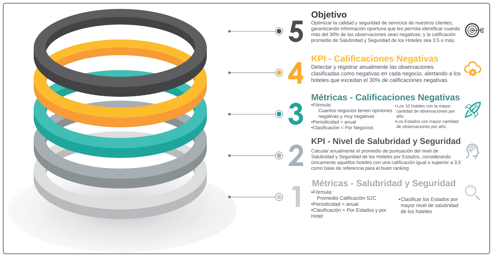
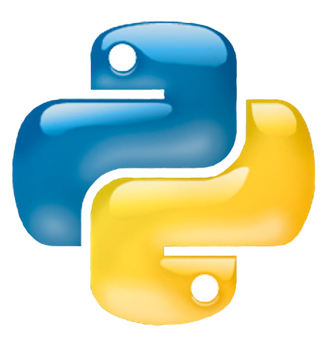
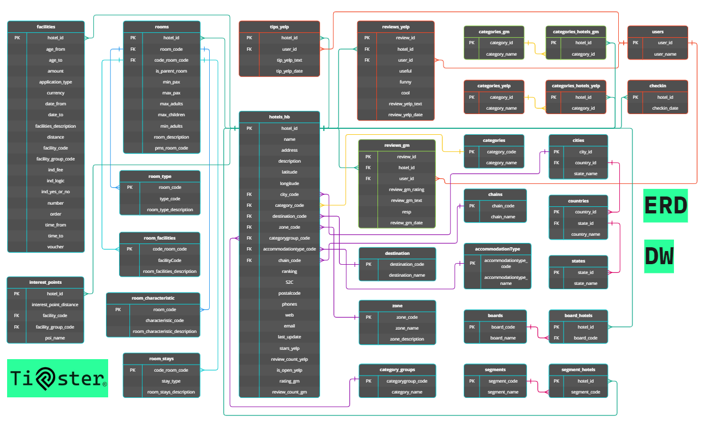
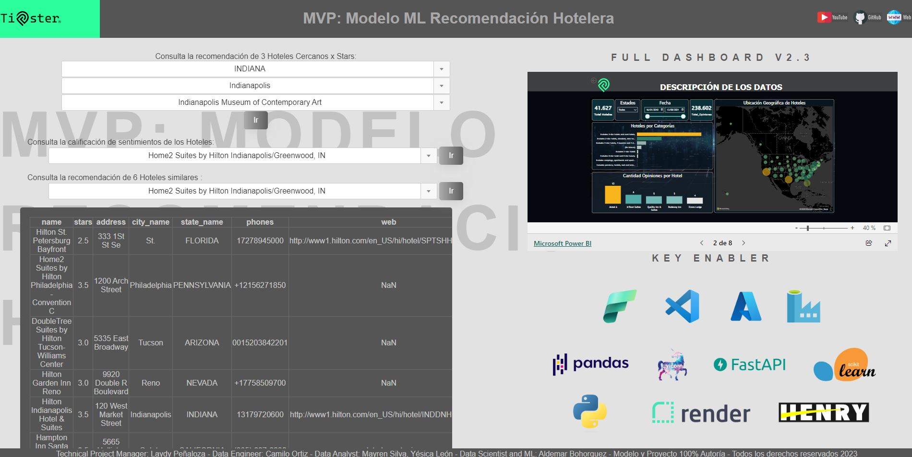
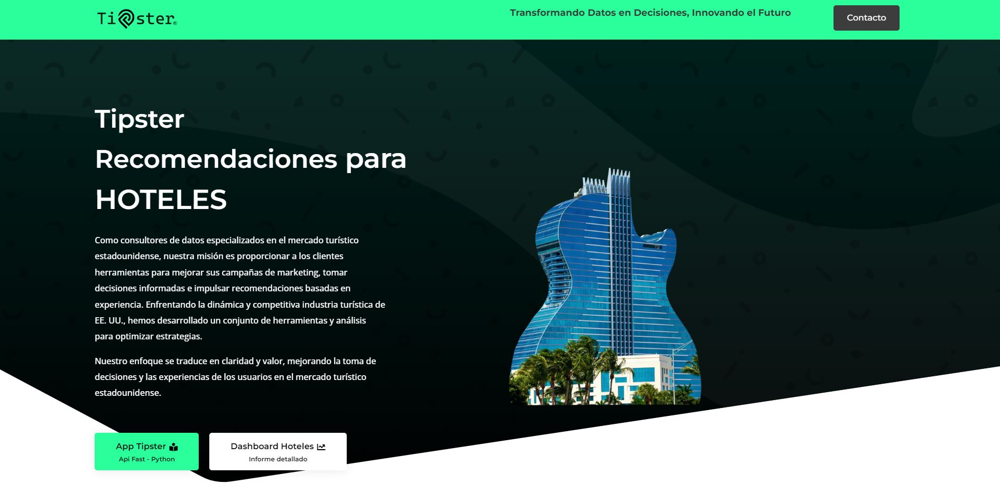

# <h1 align=center> **COMMERCE DATA ALALYSIS AND RECOMMENDATIONS** </h1>

## Tipster 

-----

# **Tabla de Contenido**

- [El Repositorio](#el-repositorio)
- [Autores](#autores)
- [Introducción](#introducción)
- [Entendimiento de la Situación Actual del Sector](#entendimiento-de-la-situación-actual-del-sector)
- [Alcance](#alcance)
- [Objetivos y Key Performance Indicators - KPI's](#objetivos-y-key-performance-indicators---kpis)
- [Desarrollo del Proyecto](#desarrollo-del-proyecto)
    - [Stack Tecnologico](#stack-tecnológico)
    - [ETL (Extract, Transform, Load)](#etl-extract-transform-load)
    - [EDA (Exploratory Data Analysis)](#eda-exploratory-data-analysis)
    - [Automatización del Data Warehouse en Microsoft Fabric](#automatización-del-data-warehouse-en-microsoft-fabric)
      - [Pipeline](#♦-pipeline)
      - [Esquema de la Base de Datos](#♦-esquema-de-la-base-de-datos)
    - [Metodología de Trabajo](#stack-tecnológico---pipeline)
    - [Datos](#datos)
    - [Modelo de Recomendación](#modelo-de-recomendacion)
-----

-----
# **El Repositorio**

En el repositorio se encuentran los siguientes archivos:

|   **Carpeta Principal** |   **Subcarpeta** |   **Descripción** |   **Link** |
|-------------------------|------------------|-------------------|------------|
|1_ETL                    |                  |Esta carpeta contiene los primeros archivos de ETL realizados al inicio del proyecto y los ETL de Normalización de Tablas producto de la automatización en Microsoft Fabric. |[1_ETL](1_ETL)    |
|1_ETL                    |APIs              |Subcarpeta con la API utilizada para la extracción de información HotelBeds.                |                  |
|2_Datasets               |                  |Carpeta raiz con los Datasets del proyecto.|[2_Datasets](2_Datasets)      |
|2_Datasets               |beta              |Subcarpeta con los Datasets en formato ".csv" originados luego del primer ETL aplicado.      |                  |
|2_Datasets               |launch            |Subcarpeta con los Datasets en formato ".csv" y ".zip" originados luego del proceso de "EDA" - Análisis Exploratorio de Datos.|                 |
|3_EDA                    |                  |Carpeta que contiene los notebooks con los "EDA" - Análisis Exploratorio de Datos, de los datasets de la empresa.|[3_EDA](3_EDA)           |
|4_Model_ML               |                  |Carpeta con los Notebooks de los Modelos de Machine Learning aplicados al proyecto.    |[4_Model_ML](4_Model_ML)                  |
|5_Sources                |                  |Carpeta de recursos web.|[5_Sources](5_Sources)       |
|5_Sources                |Images            |Subarpeta con las imágenes utilizadas en los archivos .md, .ipynb, web.|  |
|5_Sources                |Videos            |Subcarpeta con los videos utilizados en los archivos .md, .ipynb, web.|     |
|6_Documentation          |                  |Esta carpeta principal contiene información sobre material de apoyo o complementario necesario para el desarrollo del proyecto.|[6_Documentation](6_Documentation)            |
|6_Documentation          |Dictionaries      |Contiene los diccionarios de los Modelos de Entidad Relación de las Bases de Datos.|                   |
|6_Documentation          |KPI               |Contiene información sobre los KPI propuestos para el proyecto.|       |
|6_Documentation          |MER               |Contiene los Modelos de Entidad Relación elaborados para las bases de datos, Yelp, Google Mps, HotelBets y el Data Warehouse.|       |
|6_Documentation          |Presentations_Sprint|Contiene las presentaciones realizadas por cada sprint de avance entregado.|  |
|7_Dashboard              |                  |En esta carpeta se encuentra el Dashboard con las métricas de los KPI propuestos.|[7_Dashboard](7_Dashboard)              |
|8_Public                 |                  |Esta carpeta contiene los archivos para el deployment.|[8_Public](8_Public)|
|8_Public                 |static            |Información fija para fastapi, jinja2, uvicorn.       |       |
|8_Public                 |templates         |Plantilla para fastapi, jinja2, uvicorn.              |       |

-----

-----
# **Autores** 

# <h1 align=center> </h1>

|Nombre               | Rol                     | Correo                     | GitHub                                          | Linkedin|
|---------------------|-------------------------|----------------------------|-------------------------------------------------|---------|
|Leydy Lucena Peñaloza Rojas |Technical Project Managet, Data Engineer, Data Scientist |leydy.penaloza@gmail.com    |[leydypenaloza](https://github.com/leydypenaloza)    |[leydy-penaloza](https://www.linkedin.com/in/leydy-penaloza/#:~:text=www.linkedin.com/in/leydy%2Dpenaloza)|
|Edisson Camilo Ortiz López  |Data Analyst, Data Engineer, Visual Designer |eortiz@cistelsa.com   |[cistelsa](https://github.com/cistelsa)            |[camilo-ortiz-cistelsa](https://www.linkedin.com/in/camilo-ortiz-cistelsa)|
|Aldemar Bohorquez Rodriguez |Data Engineer, Data Scientist, Machine Learning Engineer|abr942010@gmail.com   |[aldemarbr94](https://github.com/aldemarbr94)            |[aldemar-bohorquez-rodriguez](https://www.linkedin.com/in/aldemar-bohorquez-rodriguez/)|
|Mayren Gabriela Silva Basto |Data Analyst, Data Engineer, Machine Learning Engineer  |mayrensilva95@gmail.com     |[MayrenS95](https://github.com/MayrenS95)        |[mayren-gabriela-silva-basto](https://www.linkedin.com/in/mayren-gabriela-silva-basto-67b645181/)|
|Yesica Milagros Leon Ccahuana |Data Analyst, Data Engineer, Data Scientist|agrostopo@gmail.com|[yesicamilagros](https://github.com/yesicamilagros)|[yesica-leon-ccahuana](https://www.linkedin.com/in/yesica-leon-ccahuana-1706a7216/)|

-----

-----
# **Introducción**

Como consultores de datos, centrados en el análisis del mercado del turismo estadounidense, presentamos a continuación el desarrollo de este proyecto. Nuestra misión es proporcionar a los clientes finales herramientas que les permitan mejorar sus campañas de marketing, tomar decisiones informadas sobre inversiones y ofrecer recomendaciones basadas en experiencias previas para sus usuarios.

El mercado del turismo en Estados Unidos es dinámico y competitivo. Nuestro proyecto aborda la necesidad de comprender mejor este mercado y aprovechar sus oportunidades; con este objetivo en mente, hemos desarrollado un conjunto de herramientas y análisis que ayudarán a nuestros clientes a optimizar sus estrategias.

En este repositorio, encontrará detalles sobre nuestra metodología, análisis de datos, modelos de Machine Learning y visualizaciones que respaldan nuestras recomendaciones. Esperamos que este proyecto brinde claridad y valor a nuestros clientes, mejorando la toma de decisiones y las experiencias de sus usuarios en el mercado del turismo norteamericano.

# <h1 align=center></h1>
-----

-----
# **Entendimiento de la Situación Actual del Sector**

En la actualidad la opinión de los usuarios se ha convertido en un insumo importante para la toma de decisiones en las organizaciones. Sin importar el tamaño de las mismas, la experiencia que proporciona un producto y/o servicio se ha venido transformando con el paso del tiempo y el uso de las tecnologías, pues estas permiten el estar más interconectados, indistintamente del lugar en el que nos encontremos.

“El 52% de los usuarios a nivel global creen que las empresas deben tomar acciones para mejorar a partir del feedback de sus clientes”, según Microsoft. Las empresas son conscientes de lo anterior y del nivel de afectación que conlleva la facilidad con la que hoy día los usuarios comunican sus experiencias y como esto influye en las decisiones de posibles clientes, permitiendo el reaccionar, transformarse, anticiparse a diversas acciones del usuario, incluso fidelizar al mismo.

Por tanto, existen plataformas en la web que permiten recopilar esta información, como Yelp, que es una plataforma de reseñas de todo tipo de negocios, restaurantes, hoteles, servicios entre otros. Los usuarios utilizan el servicio y luego suben su reseña según la experiencia que han recibido; asimismo, Google posee una plataforma de reseñas de todo tipo de negocios, restaurantes, hoteles, servicios, entre otros integrada en su servicio de localización y mapas, Google Maps.

Sin embargo, toda esta información no es de utilidad sin el procesamiento y manejo adecuado, por ello, gracias al avance de la ciencia enfocada en el análisis de datos, se pueden usar herramientas que permiten identificar el estado actual, tendencias, pronósticos y supuestos en diversos escenarios, para finalmente tomar las decisiones pertinentes que permitan aumentar la satisfacción del cliente, posicionar la marca y utilidad de la organización.

-----
-----
# **Servicios**

Nuestra Aplicación ofrece a los clientes información precisa respecto a:

1. **Outsourcig Logístico:** identificamos áreas de mejora a partir de opiniones y calificaciones negativas, impulsando una experiencia de hospedaje más satisfactoria.

2. **Recomendaciones para segmentación de Anuncios en Google y Redes Sociales:** Utilizamos análisis de datos y modelos de machine learning para recomendar estrategias de segmentación. Identificamos empresas similares a través de recomendaciones de usuarios y realizamos un análisis detallado. Evaluamos puntuaciones de HotelBeds, rankings de diversas plataformas y extraemos información relevante sobre la competencia. Esta información nos permite mejorar el posicionamiento y la estrategia a desarrollar en anuncios de Google y redes sociales.

3.  **Recomendaciones de ubicación para nuevos Hoteles:** Utilizamos análisis de datos y modelos de machine learning para determinar las ubicaciones ideales para nuevos hoteles en su cadena. Consideramos una variedad de variables, incluyendo la densidad de población, el turismo, el flujo de viajeros, eventos locales y los precios de la propiedad raíz. Esto nos permite maximizar el potencial de éxito en el mercado para sus nuevos hoteles. **_Próximamente_**

## **_♦ Propuesta de valor:_**

Lo que hace que nuestros servicios sean valiosos para nuestros clientes:

-----
-----
# **Alcance**

* Se seleccionarán otras plataformas de información, además de Yelp y Google Maps, que contengan información pertinente y permitan complementar el proceso de ETL y EDA.
* Se usarán diversas herramientas tecnológicas, como Micfrosoft Fabric, para llevar a cabo el proceso de ETL y EDA.
* Se facilitará un dashboard y un sistema de recomendaciones del negocio a través de una API o aplicación.
* Estos servicios están disponibles solo para hoteles con una antiguedad mínima de creación de un año, ya que si son cadenas de Hoteles nuevas no tenemos un histórico de data para ofrecer el servicio.
-----

-----
# **Objetivos y Key Performance Indicators - KPI's**

La documentación detallada de los KPI la encuentra en este enlace: [KPI](6_Documentation/KPI/Documentacion_KPI.ipynb)

## **_♦Objetivo No 1:_**

Orientar nuestros esfuerzos hacia la mejora continua de la satisfacción del cliente en todos los aspectos de cada negocio; respaldada por la evaluación regular de indicadores clave como el Net Promoter Score (NPS) de los negocios por Estados y el Índice de Satisfacción del Cliente por negocio, con el propósito de fomentar relaciones a largo plazo y promover recomendaciones positivas.

## **_♦Objetivo No 2:_**

Formular estrategias que promuevan un crecimiento sostenible y una expansión efectiva de la empresa, con un enfoque en el aumento constante de la Tasa de Retención de Clientes por Negocio y el comportamiento de la cantidad de clientes a los cuáles se les brinda el servicio, por negocio.

## **_♦Objetivo No 3:_**

Optimizar la calidad y seguridad de servicios de nuestros clientes, garantizando información oportuna que les permita identificar cuando más del 30% de las observaciones sean negativas; y la calificación promedio de Salubridad y Seguridad de los Hoteles sea 3.5 o más.

--------

--------
# <h1 align=center> **DESARROLLO DEL PROYECTO**</h1>
--------
--------
# **Stack Tecnológico**

Son diversas herramientas las cuales nos van a ayudar a cumplir nuestros objetivos a nivel Técnico y Profesional, a continuación se detallan de la mejor forma:

**Microsoft Fabric:** Es un todo en uno de data, se integran todas las herramientas para ETL, EDA y DA.
Se propuso esta herramienta con el fin de adelantarnos a la tendencia, ya que se encuentra en fase Beta y pronto saldrá la versión Oficial, viniendo de Microsoft y la inversión que ha realizado los ultimos años en herramientas de data posicionandose en segundo lugar, tendremos la mejor experiencia en un entorno muy Profesional y nos ayudará para futuros proyectos en diferentes empresas.

**Phyton:** Python es un lenguaje de programación versátil ampliamente utilizado en ciencia de datos. Con bibliotecas como Pandas y NumPy, permite el análisis y manipulación de datos. Su flexibilidad lo hace ideal para automatizar tareas, trabajar con SQL y conectarse a herramientas como Apache Spark Data Factory en este proyecto.

**Apache Spark:** Hadoop y Spark nos ayuda para el procesamiento de grandes cantidades de datos en forma de nodos, paralelizando el trabajo y siendo más eficiente de acuerdo su configuración y el tipo de archivo que se use, lo podremos gestionar con Python o con SQL.

**Scikit Learn:** Lo usaremos para crear nuestros modelos de ML, también con una herramienta "Experiment" la cual realizamos un seguimiento del desarrollo a los modelos de ML y validar las hipotesis.

**Power Bi:** Aprovecharemos esta herramienta para realizar, el analisis y la vizualización de datos creando un Dashboard muy profesional y en la web.

**MatPlotlib:** Es indispensable para crear el mejor informe EDA para que nuestros clientes puedan acceder a él de la forma más legible e intuitivo, será necesario traer nuestros modelos de ML allí y exponerlos.

**Kusto (KQL):** Muy posiblemente usaremos streaming de datos, no es algo seguro pero lo proponemos desde el inicio.

**Microsoft Azure:** Usaremos la nube de Microsoft para apoyarnos respecto a Bases de datos de SQL Server de ser necesarias, también para realizar el deploy de la aplicación para nuestros clientes a través de Fast API, usando Docker.

----------

----------
# **ETL (Extract, Transform, Load)**

En la fase de Extracción, Transformación y Carga (ETL), recopilamos y preparamos los datos relevantes para su análisis. Este proceso implica la obtención de información de diversas fuentes, la limpieza y transformación de datos para garantizar su calidad y consistencia, y finalmente la carga de los datos en nuestro entorno de análisis. A través de esta etapa, garantizamos que los datos estén listos para ser utilizados en nuestro proyecto de mejora de la experiencia de hospedaje y en la estrategia de segmentación publicitaria.

La documentación detallada de los Notebook que contienen los ETL tanto de la extracción inicial como de la automatización la encuentra en este enlace: [ETL](1_ETL)

----------
----------

# **EDA (Exploratory Data Analysis)**

Durante la fase de Análisis Exploratorio de Datos (EDA), investigamos en profundidad los conjuntos de datos que hemos recopilado. Exploramos patrones, tendencias y relaciones dentro de los datos. Esto nos permite identificar insights clave y desentrañar información valiosa sobre las áreas de mejora en la experiencia de hospedaje. Además, el EDA nos ayuda a comprender mejor el panorama competitivo para perfeccionar nuestras estrategias publicitarias.

A continuación presentamos algunas de las conclusiones obtenidas en la realización de esta fase, en algunos de los Datasets:

  * EDA Dataset Business
      - Se realizó limpieza de la data, así:
        1. **Nulos:** Se convierten los valores no numéricos en NaN en las columnas _'postal_code'_ y _'address'_.
        2. **Duplicados:** La Data no contenía valores duplicados
        3. **Formato:** Se realizó cambio de formato a las variables que requerían cambio a _int_ o _float_.

      * Al analizar la correlación entre las variables se identificó que no existe una relación lineal clara entre las variables, es decir, que los valores de una variable no están relacionados de manera predecible con los valores de la otra variable.

      * De acuerdo con la ubicación en el mapa, los datos por Georeferenciación no se ubican solo en Estados Unidos, sino que algunas coordenadas se encuentran en Canada, dato que se debe tener en cuenta en los análisis que se realicen durante la ejecución del proyecto.

      * Hay 2.709 categorías que incluyen la palabra **"Hotels"**, pero que no necesariamente los negocios son hoteles, por lo que el nuevo Dataset se envía a proceso de ETL para la extracción de los negocios que corresponden a **Hoteles** lo cual reducirá de manera significativa la base de datos original.
  
  * EDA Datasets Google Maps
      - Se destaca que el dataframe cuenta ahora con 17 columnas, de las cuales 'text_user', 'description', 'MISC' y 'relative_results' tienen campos vacíos, sin embargo permanecen en el dataset ya que se considera que su información será de utilidad para análisis posteriores.

      - Las variables no estan correlacionadas en un rango significativo pues el valor más alto de correlación es de 0.45 que se da entre 'rating_user' y 'avg_rating'.

      - La mayor cantidad de reseñas de los usuarios es en el estado de Colorado con un total de 258, seguido de Nevada con 218 y Massachusetts con 205; por otra parte los estados que tienen una menor cantidad son North Carolina y Washington con 8 reseñas en total.

      - La mayor cantidad de hoteles se encuentra en el estado de Texas con un total de 87, seguido de California con 83, New York y Florida con 75; por otra parte los estados que tienen una menor cantidad son Delaware y Distric_of_Columbia con 1 hotel en total.

La documentación detallada de los Notebook que contienen los EDA la encuentra en este enlace: [EDA](3_EDA)

----------
----------
# **Automatización del Data Warehouse en Microsoft Fabric**

La automatización del Data Warehouse es un paso crítico en nuestro proyecto. Implementamos flujos de trabajo automatizados y programación para garantizar que los datos se actualicen de manera regular y precisa. Esto permite que nuestras recomendaciones estén siempre respaldadas por datos actualizados y relevantes. Nuestra automatización se enfoca en mantener la integridad de los datos y facilitar un acceso rápido a la información necesaria para impulsar su estrategia de posicionamiento y publicidad en Google y Redes Sociales.

https://github.com/cistelsa/Commerce_Data_Analysis_and_Recommendations/assets/17438992/fce4aa00-97e7-410e-b641-de1286028069

 *Musica de fondo creada por inteligencia artificial - [https://soundful.com/](https://soundful.com/)*

## **_♦ Pipeline_**

El diagrama de Pipeline Tecnológico que representa la arquitectura de nuestro proyecto se presenta a continuación:

[def]: #stack-tecnológico---pipeline

## **_♦ Esquema de la Base de Datos_**

El Data Warehouse tiene un esquema de copo de nieve donde se usa la tabla de hechos **hotels** como centro, las demás tablas proveen mas informacion al analista al hacer **_queries_**, pero solo si le es necesaria. Así, la base de datos es de la siguiente forma:

Todos los diagramas de las bases de datos se encuentran en un solo Notebook el cual se encuentra en este enlace: [MER](6_Documentation/MER/entidad_relacion.ipynb)

-----------
-----------
# **Modelos de Machine Learning**

Para el Machine Learning se usaron las librerías NLTK (Natural Language Toolkit) y sklearn. La primera es la de referencia en Python para realizar procesado del lenguaje natural (PLN). Ella incluye todas las herramientas necesarias para trabajar con PLN, entre las que se incluyen tokenización, lematización, etiquetado gramatical, análisis sintáctico y análisis de sentimientos (positivo, negativo o neutro). En nuestro caso se implementó en el análisis de sentimientos para determinar la polaridad emocional de las opiniones de las personas acerca de los hoteles.

Por otra parte, para el sistema de recomendación de hoteles se hizo uso del método 'TF-IDF' (Frecuencia de Término – Frecuencia Inversa de Documento) de la biblioteca sklearn, la cual también es referencia en cuanto al aprendizaje automático en Python. El método usado es un algoritmo muy común para transformar el texto en una representación significativa de números, es decir, calcula la frecuencia con la que una palabra dada aparece dentro de un documento y le asigna una puntuación. Así que mediante 'TfidfVectorizer' se tokeniza dichas palabras, luego este aprende el vocabulario (palabras) y las ponderaciones inversas de frecuencia, generadas con 'TfidfTransformer', lo que reduce la escala de las palabras que aparecen mucho. En nuestro caso se usó las opiniones de las personas para dar la recomendación de hoteles (es una apliacación del filtrado colaborativo).

-----------
-----------
# **Implementación Sitio Web - Deployment**

El proceso de deploy implica para este proyecto implicó tomar el código fuente y los recursos necesarios que han sido desarrollados y probados en un entorno de desarrollo o pruebas y ponerlos en funcionamiento en un entorno real en línea.

Tareas Desarrolladas:

  - Preparación de servidores: Configurar los servidores y recursos necesarios en un entorno de producción.

  - Carga de código: Copiar los archivos y código fuente al servidor o entorno en producción.

  - Configuración: Ajustar la configuración del software para que funcione en el entorno de producción.

  - Pruebas de último minuto: Realizar pruebas finales para asegurarse de que todo funcione correctamente en el entorno de producción.

  - Publicación: Poner la aplicación o sistema en línea y accesible para los usuarios finales.

  - Monitoreo y mantenimiento: Supervisar el funcionamiento del software en producción y llevar a cabo tareas de mantenimiento continuo.

Para la fase de publicación, el modelo se incluyó en la página web de Tipster.

En el siguiente enlace se puede acceder a ella: [Tipster](https://tipsterhome.cistelsa.com/)

https://github.com/cistelsa/Commerce_Data_Analysis_and_Recommendations/blob/main/5_Sources/Videos/Deploy_Tipster.mp4